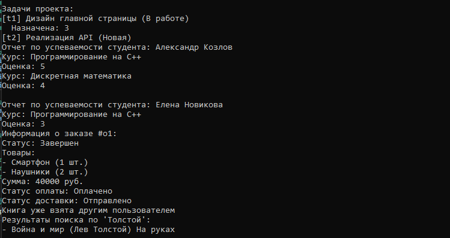

<h2>1. Система управления проектами с ролями</h2>
    
Классы: User, Role, Permission, Project, Task, Comment. Роли пользователей, права доступа, комментарии.

    <h2>2. Система учебного процесса</h2>
    
Классы: Student, Course, Instructor, Enrollment, Grade, Schedule. Учет успеваемости, расписание.

    <h2>3. Интернет-магазин</h2>
    
Классы: Product, Order, Customer, ShoppingCart, Payment, Shipping. Корзина, оплата, доставка.

    <h2>4. Библиотека</h2>
    
Классы: User, Book, Library, Loan, Reservation, Fine. Учет книг, штрафы.

    <h2>5. Agile-проекты</h2>
    
Классы: Sprint, Backlog, UserStory, Task, TeamMember, BurndownChart. Спринты, графики.

    <h2>6. Медицинские записи</h2>
    
Классы: Patient, Doctor, Appointment, MedicalRecord, Prescription, Billing. Приемы, рецепты.

    <h2>7. Проекты с API</h2>
    
Классы: Project, Task, User, ExternalAPI, Notification, Report. Интеграция API.

    <h2>8. Управление событиями</h2>
    
Классы: Event, Participant, Ticket, Venue, Schedule, Feedback. Билеты, отзывы.

    <h2>9. Финансы</h2>
    
Классы: Transaction, Account, Currency, ExchangeRate, Budget, Report. Валюты, бюджет.

    <h2>10. Микросервисы</h2>
    
Классы: Service, API, Database, MessageQueue, LoadBalancer, Client. Балансировка нагрузки.

   
